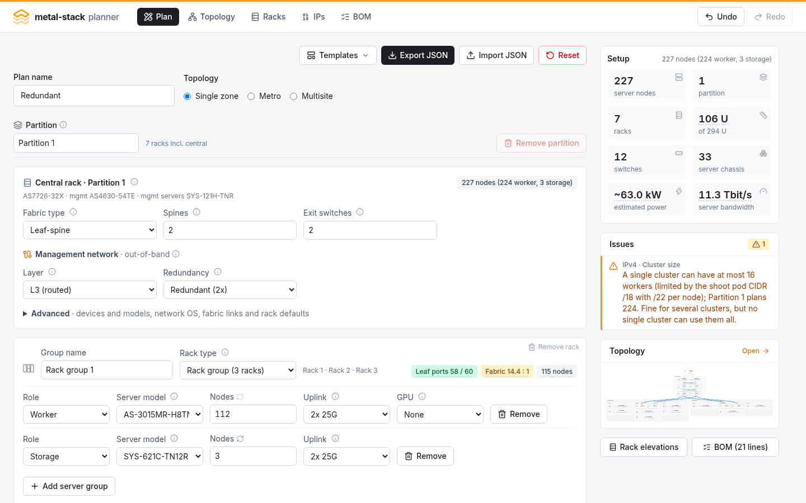
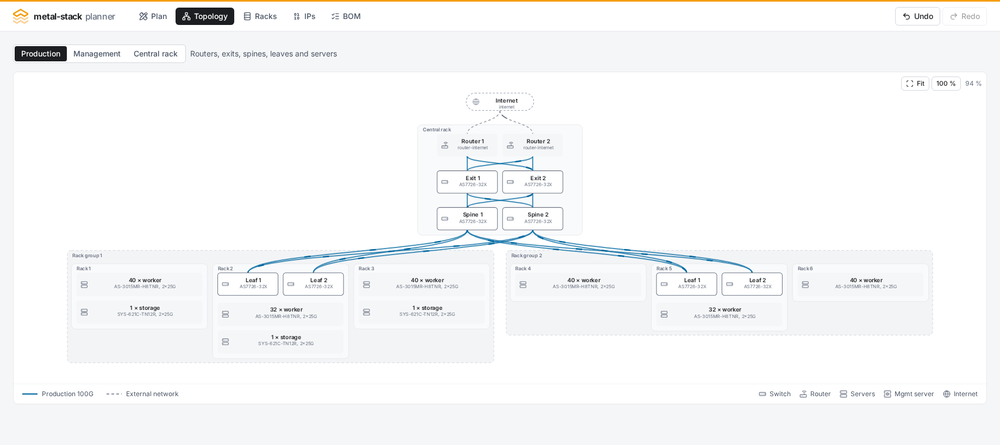
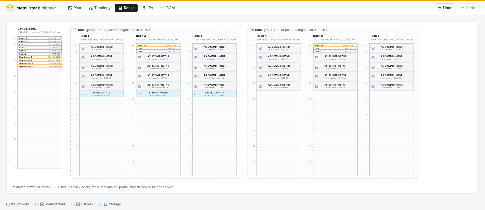
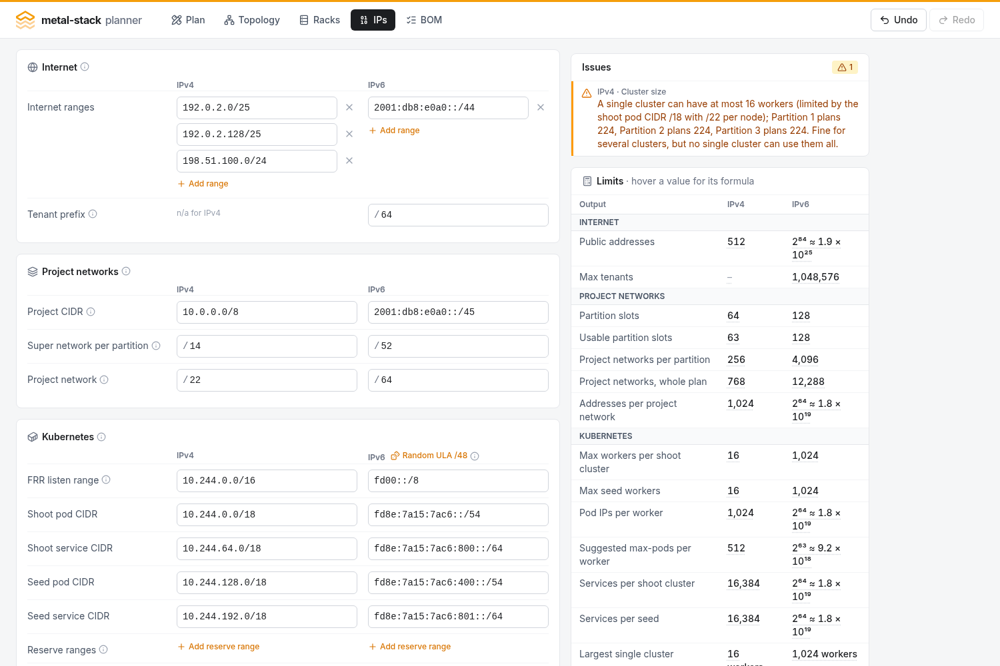
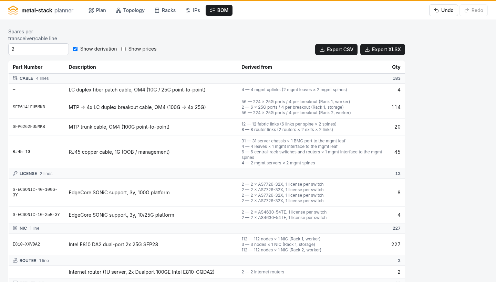

<p align="center">
  
</p>

<h1 align="center">metal-stack planner</h1>

<p align="center">
  Plan a <a href="https://metal-stack.io">metal-stack</a> installation in the browser:<br />
  configure the production and management networks, see the resulting topology and rack elevations,<br />
  and get an orderable hardware bill of materials.
</p>

<p align="center">
  <strong><a href="https://metal-stack.github.io/planner/">Open the planner</a></strong>
</p>

---

> **Alpha.** This project is in an early stage: the hardware catalog, the derivation rules and
> the plan file format are still moving, and the numbers it produces need review before anyone
> orders from them. Plan files carry a format version and older ones are migrated on import, but
> expect rough edges.

The planner is a client-only single-page app. Everything you enter stays in your browser
(localStorage) and can be exported as a JSON file. There is no backend and the app makes no
network requests.

## Why

A metal-stack installation ties a lot of numbers together: racks, ports, power, bandwidth,
addresses and part numbers all move as soon as one of them does. The planner keeps them
consistent — you edit the plan, everything else follows from it.

- **One document** — partitions, racks, server groups, the management network and the address
  plan in a single plan file.
- **Always in sync** — topology, rack elevations, port and power budgets, the IP plan and the BOM
  are recomputed as you type, and checked against the official metal-stack hardware compatibility
  list.
- **Ready to order** — every BOM quantity says how it was derived, so the order can be reviewed
  rather than trusted.

## What it does

- **Plan editor** — one or more partitions (metal-stack failure domains), each with a central
  rack (internet routers, exits, spines, optional superspines, management spines and management
  servers), any number of compute racks, and the external networks that attach at the routers. A compute rack is either a single rack or a _rack group_: three
  physical racks sharing the middle rack's leaf pair and management leaf. Every physical rack
  gets its own number by default (a group takes three), and names stay editable.
- **Live feedback** — a side panel shows node and rack tallies, validation issues that jump to the
  section they belong to, and a topology thumbnail. All of it updates as you type.
- **Validation** — leaf, spine, exit, management leaf and management spine port budgets
  (including the 4×25G breakout math for 25G server uplinks), rack height and power budget,
  fabric oversubscription (every rack shows its leaf → spine ratio, and a partition can require a
  non-blocking 1:1 fabric), management network redundancy, and the official metal-stack hardware
  compatibility list.
  Dropdowns only offer hardware that is supported for the role. Every issue points at the
  section that can fix it.
- **Topology view** — the fabric per partition, switchable between the production network
  (default), the management network, and the central rack alone. Wheel to zoom, drag to pan,
  hover a device to highlight its links, click a rack to jump to its editor section.
- **Rack view** — height-unit elevations of every physical rack with an estimated power draw
  against the rack's budget; a rack group's three racks are drawn in one box, showing how its
  chassis spread evenly across them. Click a rack to edit it.
- **BOM** — switches with their SONiC licenses, internet routers, servers (chassis derived
  from node counts), NICs, spares, and the complete cabling: server uplinks with breakout
  math, 100G fabric and router links, copper OOB and management links, and the fiber uplinks of
  the management leaves. Grouped by category, scoped to the whole plan or one partition, with an
  optional "derived from" column that explains every quantity. On screen and as CSV or XLSX.
- **IP address plan** — IPv4 and IPv6 (dual-stack) ranges of the setup: public internet ranges,
  the project CIDR with one super network per partition, and the Kubernetes pod and service
  ranges of shoot and seed clusters. The tab derives the limits (partitions, project networks,
  workers and pods per cluster, services, tenants), allocates a super network to every partition,
  shows an example cluster, and sizes the infrastructure ranges of each partition — underlay
  loopbacks, PXE, management and transfer networks — from the plan's switches and servers.
  Overlapping or misaligned ranges are reported like any other issue, and the address plan
  exports as CSV.
- **Ansible export** — an inventory, group and host variables for the
  [metal-roles](https://github.com/metal-stack/metal-roles) partition roles (sonic-config,
  metal-core, mgmt-server, dhcp, metal-bmc, pixiecore, image-cache) and the playbooks that apply
  them, laid out like a metal-stack deployment repository. Hostnames, ASNs, loopbacks, management
  addresses, per-leaf PXE networks, DHCP ranges and transfer networks come from the plan and the
  IP plan; secrets, endpoints and switch ports are marked `CHANGE_ME` and listed. Previewed file
  by file and downloaded as a zip.
- **Prices** — an optional price book (kept in the browser, separate from the plan, importable
  and exportable as JSON) turns the BOM into a cost estimate with line totals, category
  subtotals and a grand total.
- **Undo/redo, templates, JSON export/import** — every change is undoable; three templates
  give you a valid starting point; plans round-trip through JSON files that carry a format
  version, so files written by an older planner are migrated when they are imported.

## Screenshots

The screenshots show the **Redundant** template: one partition with a redundant management
network, two rack groups with 112 workers each and three storage servers.

### Plan editor with live side panel

The central rack shows the counts that size the fabric; hardware models, routers, storage leaves,
fabric links and rack defaults sit in its folded Advanced section. Each rack or rack group shows
its leaf ports, fabric ratio and node count on the right of its header.



### Topology

Production view: routers, exits and spines in the central rack, compute racks below, a
rack group as three physical racks in one box. The management and central-rack views show the
other network and the central rack alone. Server uplinks and BMC links are intentionally not
drawn.



### Rack elevations

Every physical rack with its own number; a rack group's three racks share one box, with the leaf
pair and management leaf in the middle rack.



### IP address plan

The Three partitions template with the compact pod-range preset: the IPv4 and IPv6 inputs on the
left, the derived limits and issues on the right.



### Bill of materials

With derivation shown: every quantity broken down by central rack and rack group.



## Getting started

The planner runs at **[https://metal-stack.github.io/planner/](https://metal-stack.github.io/planner/)** — no install, no account, nothing leaves your browser.

To run it locally:

```sh
npm install
npm run dev        # http://localhost:5173
```

Other commands:

```sh
npm run build      # type-check and build to dist/
npm run preview    # serve the production build
npm run test       # run the unit tests once
npm run test:watch # vitest in watch mode
```

Open the app and pick a template from **Templates ▾** on the Plan tab, or start from the
default plan. Use **Export JSON** to save a plan file and **Import JSON** to load one.

### Templates

| Template         | Contents                                                                                                  |
| ---------------- | --------------------------------------------------------------------------------------------------------- |
| Starter          | One partition, non-redundant management network, one rack with 8 workers on a leaf pair.                  |
| Redundant        | One partition, redundant management network, two rack groups with 112 workers each and 3 storage servers. |
| Three partitions | Multisite topology with three partitions, each like _Redundant_.                                          |

## How it works

The whole app operates on a single `Plan` document, described by Zod schemas in
`src/model/plan.ts`. Everything else is derived from it and never stored:

| Module                     | Derives                                                 |
| -------------------------- | ------------------------------------------------------- |
| `src/derive/bom.ts`        | BOM lines and quantities                                |
| `src/derive/topology.ts`   | the topology graph (nodes and links)                    |
| `src/derive/rackLayout.ts` | rack elevations and the rack-group spread               |
| `src/derive/validate.ts`   | validation issues                                       |
| `src/derive/nodes.ts`      | node tallies per rack, partition and plan               |
| `src/derive/ip/`           | CIDR arithmetic, the IP address plan and its validation |

Hardware facts — part numbers, port counts, height units, nodes per chassis, and metal-stack
compatibility — live in `src/model/catalog.ts`. The compatibility data mirrors the official
[hardware list](https://docs.metal-stack.io/docs/hardware).

State lives in a Zustand store with undo history and localStorage persistence
(`src/store/planStore.ts`). Views under `src/views/` only render; the topology and rack
diagrams are plain SVG.

## Development

- TypeScript, React 19, Vite, Tailwind CSS 4, Zustand, Zod, Vitest.
- Every derivation rule has a unit test next to it (`*.test.ts`). Run `npm run test`.
- `CLAUDE.md` documents the architecture and domain conventions for contributors.
- Contributions follow the [metal-stack contributing guide](https://docs.metal-stack.io/stable/development/contributing/).

## Dependencies and advisories

Runtime dependencies are deliberately few: React, Zustand (with Zundo for undo), Zod, Lucide for
icons and ExcelJS for the xlsx export. Everything else is build tooling.

`npm audit` reports two moderate advisories against `uuid <11.1.1`
([GHSA-w5hq-g745-h8pq](https://github.com/advisories/GHSA-w5hq-g745-h8pq)), reached through
ExcelJS. The flaw is a missing bounds check that only applies when a `buf` argument is passed to
`uuid`, which neither this app nor ExcelJS's use of it does. The only available fix downgrades
ExcelJS to 3.4.0, a breaking change, so the advisory is knowingly accepted rather than unnoticed.

## Deployment

Every push to `main` that passes CI is published to GitHub Pages at
[https://metal-stack.github.io/planner/](https://metal-stack.github.io/planner/) by the `deploy` job in
[`.github/workflows/ci.yml`](.github/workflows/ci.yml). It is gated on `needs: build`, so only a
commit that passed lint, formatting, the notices check, the build and the tests is ever deployed.

A project site is served from `/<repo>/` rather than the domain root, so the workflow builds with
`BASE_PATH` set from the repository name. Local builds keep the root default, and a fork deploys
under its own name with no edit.

To reproduce the deployed build locally — worth doing if an asset ever 404s under the sub-path:

```sh
BASE_PATH=/planner/ npm run build
npx vite preview --base=/planner/   # http://localhost:4173/planner/
```

Pass the base to `preview` as well as to `build`: serving a sub-path build from the root is
exactly the mismatch that hides this class of bug.

## License

[MIT](LICENSE) — Copyright (c) 2026 The metal-stack Authors.

The production build bundles third-party code whose license notices the minifier removes;
[THIRD-PARTY-NOTICES.md](THIRD-PARTY-NOTICES.md) reproduces them, and CI checks it stays current
(`npm run notices` regenerates it).
